# CodeSubWars Architecture Overview

## 1. Overview

CodeSubWars is a physics-based 3D submarine warfare programming game. Players define submarine AI behavior in Python; submarines fight each other with torpedoes and mines in a simulated 3D underwater environment. The engine is written in C++ using Qt for the GUI, OpenGL for rendering, SOLID for collision detection, and Boost.Python for scripting integration.

The system is organized into the following major modules:

| Module | Responsibility |
|--------|---------------|
| **World & Scene** | Singleton simulation manager, scene graph, battle lifecycle |
| **Object Hierarchy** | Base object tree with transform, physics, collision, damage composition |
| **Submarine** | Player-controlled entities with engines, weapons, sensors, command execution |
| **Equipment** | Engines, sensors, weapon batteries, control center |
| **Weapons** | Torpedoes, mines, homing variants, explosion/damage emission |
| **Sensors** | Active/passive sonar, GPS, compass, movement sensor |
| **Physics & Collision** | Rigid body dynamics, force/impulse integration, SOLID collision detection |
| **Events & Messages** | Asynchronous event queue, message types, inter-object communication |
| **Commands** | Command pattern for submarine actions, command processor with stack |
| **Damage & Resources** | Health management, weapon recharging, resource providers |
| **Python Integration** | Boost.Python bindings, GIL management, per-submarine thread contexts |
| **GUI & Visualization** | Qt main window, OpenGL viewports, equipment visualizers |
| **ARSTD Library** | Utility library: math, geometry, command framework, tree structures |

### Top-Level Module Dependencies

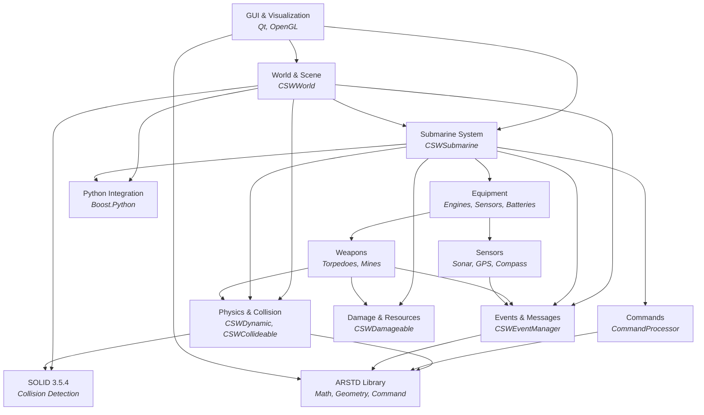
```mermaid
graph TB
    GUI["GUI & Visualization<br/><i>Qt, OpenGL</i>"]
    World["World & Scene<br/><i>CSWWorld</i>"]
    Sub["Submarine System<br/><i>CSWSubmarine</i>"]
    Equip["Equipment<br/><i>Engines, Sensors, Batteries</i>"]
    Weap["Weapons<br/><i>Torpedoes, Mines</i>"]
    Sens["Sensors<br/><i>Sonar, GPS, Compass</i>"]
    Phys["Physics & Collision<br/><i>CSWDynamic, CSWCollideable</i>"]
    Evt["Events & Messages<br/><i>CSWEventManager</i>"]
    Cmd["Commands<br/><i>CommandProcessor</i>"]
    Dmg["Damage & Resources<br/><i>CSWDamageable</i>"]
    Py["Python Integration<br/><i>Boost.Python</i>"]
    ARSTD["ARSTD Library<br/><i>Math, Geometry, Command</i>"]
    SOLID["SOLID 3.5.4<br/><i>Collision Detection</i>"]

    GUI --> World
    GUI --> Sub
    World --> Sub
    World --> Phys
    World --> Evt
    World --> SOLID
    World --> Py
    Sub --> Equip
    Sub --> Cmd
    Sub --> Evt
    Sub --> Phys
    Sub --> Dmg
    Sub --> Py
    Equip --> Sens
    Equip --> Weap
    Weap --> Phys
    Weap --> Dmg
    Weap --> Evt
    Sens --> Evt
    Phys --> SOLID
    Phys --> ARSTD
    Cmd --> ARSTD
    Evt --> ARSTD
    GUI --> ARSTD
```

---

## 2. Module Summary

| Module | Key Classes | Files (in `Source/`) |
|--------|-------------|----------------------|
| Object Hierarchy | `CSWObject`, `CSWDynSolCol`, `CSWDamDynSolCol` | `CSWObject.h/cpp`, `CSWDynSolCol.h` |
| World & Scene | `CSWWorld`, `CSWSettings`, `CSWWorldGuard`, `CSWBattleStatistics` | `CSWWorld.h/cpp`, `CSWSettings.h` |
| Submarine | `CSWSubmarine`, `CSWPySubmarine`, `CSWPySubmarineWrapper` | `CSWSubmarine.h/cpp`, `CSWPySubmarine.h` |
| Equipment | `CSWEquipment`, `CSWActuator`, `CSWControlCenter` | `CSWEquipment.h/cpp`, `CSWControlCenter.h` |
| Weapons | `CSWWeapon`, `CSWTorpedo`, `CSWMine`, `CSWWeaponBattery` | `CSWWeapon.h/cpp`, `CSWTorpedo.h`, `CSWMine.h` |
| Sensors | `CSWSonar`, `CSWActiveSonar`, `CSWPassiveSonar`, `CSWGPS`, `CSWGyroCompass` | `CSWSonar.h`, `CSWActiveSonar.h`, `CSWGPS.h` |
| Physics & Collision | `CSWDynamic`, `CSWSolid`, `CSWCollideable` | `CSWDynamic.h/cpp`, `CSWSolid.h`, `CSWCollideable.h` |
| Events & Messages | `CSWEvent`, `CSWEventManager`, `CSWIMessage`, `CSWTransceiver` | `CSWEvent.h/cpp`, `CSWEventManager.h` |
| Commands | `CSWCommands`, `CSWControlCommand`, `CSWVariousCommands` | `CSWCommands.h`, `CSWControlCommand.h` |
| Damage & Resources | `CSWDamageable`, `CSWRechargeable`, `CSWResourceProvider` | `CSWDamageable.h`, `CSWRechargeable.h` |
| Python Integration | `CSWPythonable`, `PythonContext`, `CSWIPythonable` | `CSWPythonable.h/cpp`, `PythonContext.h` |
| GUI & Visualization | `CodeSubwarsMainWindow`, `OpenGLView`, `SceneView` | `CodeSubwarsMainWindow.h`, `OpenGLView.h` |

---

## 3. Detailed Module Descriptions

### 3.1 Object Hierarchy & Scene Graph

All world entities derive from `CSWObject`, which extends `ARSTD::Node` for tree-based scene management. Objects are organized in a parent-child tree rooted at `CSWWorld`'s object tree. Each object carries a local transform (`Matrix44D`) and a computed world transform.

Composition classes combine capabilities incrementally:

- **CSWDynSolCol** = `CSWDynamic` + `CSWSolid` + `CSWCollideable` (physics body with mesh and collision)
- **CSWDamDynSolCol** = `CSWDynSolCol` + `CSWDamageable` (adds health/damage tracking)

Interfaces are used to tag capabilities: `CSWIUpdateable`, `CSWICommandable`, `CSWIEventDealable`, `CSWIDynamic`, `CSWISolid`, `CSWICollideable`, `CSWIDamageable`, `CSWISoundEmitter`, `CSWISoundReceiver`, `CSWIImpulsEmitter`, `CSWIForceEmitter`.

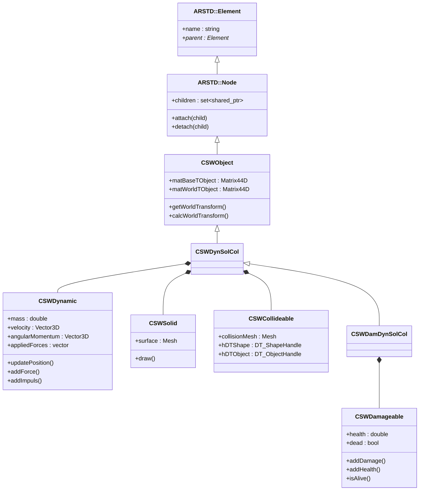
```mermaid
classDiagram
    direction TB

    class `ARSTD::Element` {
        +name : string
        +parent : Element*
    }
    class `ARSTD::Node` {
        +children : set~shared_ptr~
        +attach(child)
        +detach(child)
    }
    class CSWObject {
        +matBaseTObject : Matrix44D
        +matWorldTObject : Matrix44D
        +getWorldTransform()
        +calcWorldTransform()
    }
    class CSWDynamic {
        +mass : double
        +velocity : Vector3D
        +angularMomentum : Vector3D
        +appliedForces : vector
        +updatePosition()
        +addForce()
        +addImpuls()
    }
    class CSWSolid {
        +surface : Mesh
        +draw()
    }
    class CSWCollideable {
        +collisionMesh : Mesh
        +hDTShape : DT_ShapeHandle
        +hDTObject : DT_ObjectHandle
    }
    class CSWDamageable {
        +health : double
        +dead : bool
        +addDamage()
        +addHealth()
        +isAlive()
    }
    class CSWDynSolCol {
    }
    class CSWDamDynSolCol {
    }

    `ARSTD::Element` <|-- `ARSTD::Node`
    `ARSTD::Node` <|-- CSWObject
    CSWObject <|-- CSWDynSolCol
    CSWDynSolCol *-- CSWDynamic
    CSWDynSolCol *-- CSWSolid
    CSWDynSolCol *-- CSWCollideable
    CSWDynSolCol <|-- CSWDamDynSolCol
    CSWDamDynSolCol *-- CSWDamageable
```

#### World Entity Inheritance

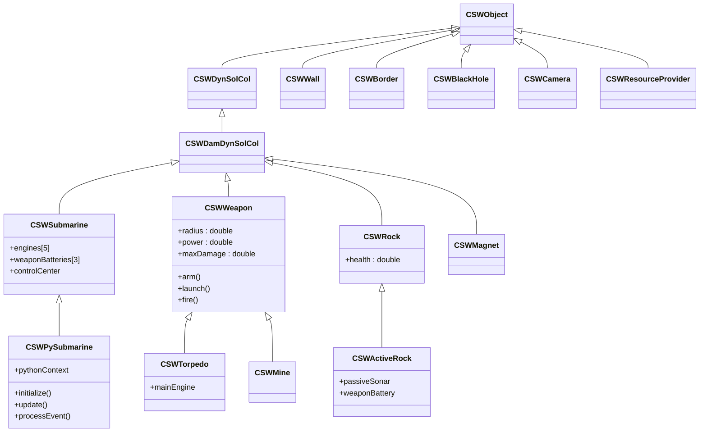
```mermaid
classDiagram
    direction TB

    class CSWObject
    class CSWDynSolCol
    class CSWDamDynSolCol

    class CSWSubmarine {
        +engines[5]
        +weaponBatteries[3]
        +controlCenter
    }
    class CSWPySubmarine {
        +pythonContext
        +initialize()
        +update()
        +processEvent()
    }
    class CSWWeapon {
        +radius : double
        +power : double
        +maxDamage : double
        +arm()
        +launch()
        +fire()
    }
    class CSWTorpedo {
        +mainEngine
    }
    class CSWMine
    class CSWRock {
        +health : double
    }
    class CSWActiveRock {
        +passiveSonar
        +weaponBattery
    }
    class CSWMagnet
    class CSWWall
    class CSWBorder
    class CSWBlackHole
    class CSWCamera
    class CSWResourceProvider

    CSWObject <|-- CSWDynSolCol
    CSWDynSolCol <|-- CSWDamDynSolCol
    CSWDamDynSolCol <|-- CSWSubmarine
    CSWSubmarine <|-- CSWPySubmarine
    CSWDamDynSolCol <|-- CSWWeapon
    CSWWeapon <|-- CSWTorpedo
    CSWWeapon <|-- CSWMine
    CSWDamDynSolCol <|-- CSWRock
    CSWRock <|-- CSWActiveRock
    CSWDamDynSolCol <|-- CSWMagnet
    CSWObject <|-- CSWWall
    CSWObject <|-- CSWBorder
    CSWObject <|-- CSWBlackHole
    CSWObject <|-- CSWCamera
    CSWObject <|-- CSWResourceProvider
```

---

### 3.2 World & Scene Management

`CSWWorld` is the central singleton that owns the simulation. It holds the scene graph root, manages the SOLID physics scene, drives the per-frame update loop, and coordinates battle lifecycle.

**Key classes:**

| Class | Role |
|-------|------|
| `CSWWorld` | Singleton. Owns object tree, SOLID scene, Python main state. Drives `recalculate()` and `draw()`. |
| `CSWSettings` | Stores battle configuration (type, team size, time mode). |
| `CSWWorldGuard` | Monitors objects for rule violations (excessive CPU usage). Removes erroneous objects. |
| `CSWBattleStatistics` | Tracks kills, hits, damage dealt per submarine. |
| `CSWLog` | Singleton logger. |

**CSWWorld key members:**

- `DT_SceneHandle m_hDTScene` -- SOLID collision scene
- `DT_RespTableHandle m_hDTRespTable` -- collision response table
- `shared_ptr<CSWObject> m_pObjectTree` -- scene graph root
- `vector<shared_ptr<CSWObject>> m_LoadedSubmarines` -- active submarines
- `vector<shared_ptr<CSWObject>> m_DynamicObjectContainer` -- all dynamic objects
- `vector<shared_ptr<CSWObject>> m_SoundReceiverObjectContainer` -- passive sonar receivers
- `PyThreadState* m_pyMainState` -- Python main interpreter state
- `QMutex m_mtxRecalc, m_mtxDraw` -- thread safety for simulation/rendering

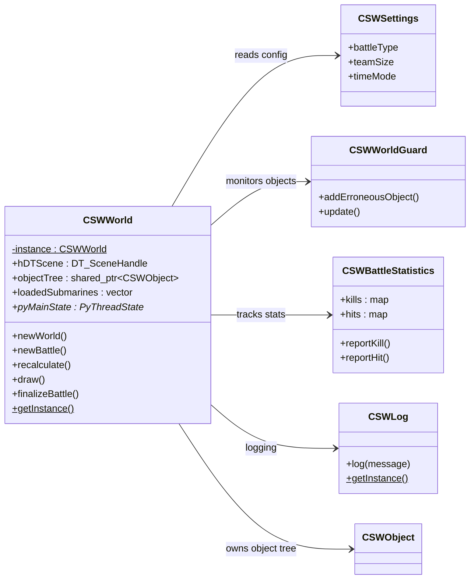
```mermaid
classDiagram
    direction LR

    class CSWWorld {
        -instance : CSWWorld$
        +hDTScene : DT_SceneHandle
        +objectTree : shared_ptr~CSWObject~
        +loadedSubmarines : vector
        +pyMainState : PyThreadState*
        +newWorld()
        +newBattle()
        +recalculate()
        +draw()
        +finalizeBattle()
        +getInstance()$
    }
    class CSWSettings {
        +battleType
        +teamSize
        +timeMode
    }
    class CSWWorldGuard {
        +addErroneousObject()
        +update()
    }
    class CSWBattleStatistics {
        +kills : map
        +hits : map
        +reportKill()
        +reportHit()
    }
    class CSWLog {
        +log(message)
        +getInstance()$
    }

    CSWWorld --> CSWSettings : reads config
    CSWWorld --> CSWWorldGuard : monitors objects
    CSWWorld --> CSWBattleStatistics : tracks stats
    CSWWorld --> CSWLog : logging
    CSWWorld --> CSWObject : owns object tree
```

---

### 3.3 Submarine System

`CSWSubmarine` is the primary player entity. It composes multiple equipment subsystems and implements several interfaces for physics, events, commands, sound, and impulse emission. `CSWPySubmarine` extends it with Python scripting support. `CSWPySubmarineWrapper` is the Boost.Python wrapper enabling Python method overrides.

**Submarine composition:**

| Component | Type | Purpose |
|-----------|------|---------|
| Main Engine | `CSWEngine` | Forward/backward propulsion |
| Buoyancy Tank | `CSWEngine` | Vertical movement |
| Bows Jet Oar | `CSWEngine` | Horizontal rotation (yaw) |
| Inclination Jet Oar | `CSWEngine` | Vertical inclination (pitch) |
| Axial Inclination Jet Oar | `CSWEngine` | Roll/twist |
| Front Left Weapon Battery | `CSWWeaponBattery` | Green torpedoes |
| Front Right Weapon Battery | `CSWWeaponBattery` | Red/Blue torpedoes |
| Back Weapon Battery | `CSWWeaponBattery` | Mines |
| Control Center | `CSWControlCenter` | Hub for GPS, compass, sonar, transceiver, map |
| Event Dealable | `CSWEventDealable` | Event queue and processing |
| Commandable | `CSWCommandable` | Command processor with stack |

Engine power scales with submarine length: `F_max ~ length^3`.

```mermaid
classDiagram
    direction TB

    class CSWSubmarine {
        +mainEngine : CSWEngine
        +buoyancyTank : CSWEngine
        +bowsJetOar : CSWEngine
        +inclinationJetOar : CSWEngine
        +axialInclinationJetOar : CSWEngine
        +frontLeftWeaponBattery : CSWWeaponBattery
        +frontRightWeaponBattery : CSWWeaponBattery
        +backWeaponBattery : CSWWeaponBattery
        +controlCenter : CSWControlCenter
        +commandable : CSWCommandable
        +eventDealable : CSWEventDealable
    }
    class CSWPySubmarine {
        +pythonContext : PythonContext
        +initialize()
        +update()
        +processEvent()
        +finalize()
    }

    class CSWEngine {
        +intensity : double
        +direction : Vector3D
        +setIntensity()
        +setDirection()
    }
    class CSWWeaponBattery {
        +weapons : set~CSWWeapon~
        +releaseNext()
        +getNumWeapons()
    }
    class CSWControlCenter {
        +gps : CSWGPS
        +gyroCompass : CSWGyroCompass
        +activeSonar : CSWActiveSonar
        +passiveSonar : CSWPassiveSonar
        +transceiver : CSWTransceiver
        +map : CSWMap
    }
    class CSWCommandable {
        +commandProcessor : CommandProcessor
        +step()
    }
    class CSWEventDealable {
        +eventQueue : deque~CSWEvent~
        +receiveEvent()
        +processReceivedQueuedEvents()
    }

    class CSWIUpdateable {
        <<interface>>
        +update()
    }
    class CSWICommandable {
        <<interface>>
        +step()
    }
    class CSWIEventDealable {
        <<interface>>
        +receiveEvent()
        +processEvent()
    }
    class CSWIImpulsEmitter {
        <<interface>>
        +emitImpuls()
    }
    class CSWISoundEmitter {
        <<interface>>
        +emitSound()
    }

    CSWSubmarine *-- CSWEngine : 5 engines
    CSWSubmarine *-- CSWWeaponBattery : 3 batteries
    CSWSubmarine *-- CSWControlCenter
    CSWSubmarine *-- CSWCommandable
    CSWSubmarine *-- CSWEventDealable
    CSWSubmarine ..|> CSWIUpdateable
    CSWSubmarine ..|> CSWICommandable
    CSWSubmarine ..|> CSWIEventDealable
    CSWSubmarine ..|> CSWIImpulsEmitter
    CSWSubmarine ..|> CSWISoundEmitter
    CSWSubmarine <|-- CSWPySubmarine
```

---

### 3.4 Equipment System

All submarine equipment derives from `CSWEquipment`, which provides directional control with angular velocity limits and smooth interpolation. Equipment is attached as children in the scene graph.

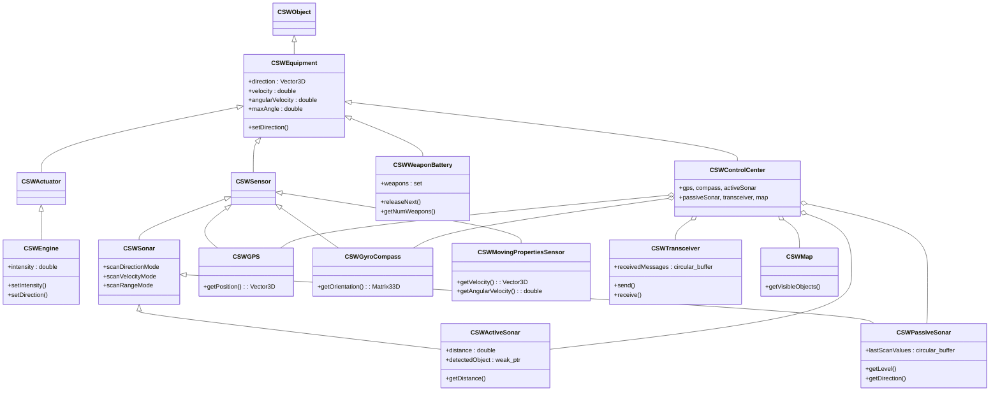
```mermaid
classDiagram
    direction TB

    class CSWEquipment {
        +direction : Vector3D
        +velocity : double
        +angularVelocity : double
        +maxAngle : double
        +setDirection()
    }
    class CSWActuator
    class CSWSensor
    class CSWEngine {
        +intensity : double
        +setIntensity()
        +setDirection()
    }
    class CSWSonar {
        +scanDirectionMode
        +scanVelocityMode
        +scanRangeMode
    }
    class CSWActiveSonar {
        +distance : double
        +detectedObject : weak_ptr
        +getDistance()
    }
    class CSWPassiveSonar {
        +lastScanValues : circular_buffer
        +getLevel()
        +getDirection()
    }
    class CSWGPS {
        +getPosition() : Vector3D
    }
    class CSWGyroCompass {
        +getOrientation() : Matrix33D
    }
    class CSWMovingPropertiesSensor {
        +getVelocity() : Vector3D
        +getAngularVelocity() : double
    }
    class CSWWeaponBattery {
        +weapons : set
        +releaseNext()
        +getNumWeapons()
    }
    class CSWControlCenter {
        +gps, compass, activeSonar
        +passiveSonar, transceiver, map
    }
    class CSWTransceiver {
        +receivedMessages : circular_buffer
        +send()
        +receive()
    }
    class CSWMap {
        +getVisibleObjects()
    }

    CSWObject <|-- CSWEquipment
    CSWEquipment <|-- CSWActuator
    CSWEquipment <|-- CSWSensor
    CSWEquipment <|-- CSWWeaponBattery
    CSWEquipment <|-- CSWControlCenter
    CSWActuator <|-- CSWEngine
    CSWSensor <|-- CSWSonar
    CSWSensor <|-- CSWGPS
    CSWSensor <|-- CSWGyroCompass
    CSWSensor <|-- CSWMovingPropertiesSensor
    CSWSonar <|-- CSWActiveSonar
    CSWSonar <|-- CSWPassiveSonar
    CSWControlCenter o-- CSWGPS
    CSWControlCenter o-- CSWGyroCompass
    CSWControlCenter o-- CSWActiveSonar
    CSWControlCenter o-- CSWPassiveSonar
    CSWControlCenter o-- CSWTransceiver
    CSWControlCenter o-- CSWMap
```

---

### 3.5 Weapon System

Weapons are world entities that inherit from `CSWDamDynSolCol` (physics body + damage). They follow a lifecycle: **create -> arm -> launch -> (guided flight) -> detonate -> dead**. Torpedoes have an engine for propulsion; mines are stationary. Homing variants carry their own sonar sensor.

**Concrete weapon types:**

| Class | Base | Features |
|-------|------|----------|
| `CSWGreenTorpedo` | `CSWTorpedo` | Standard torpedo |
| `CSWRedTorpedo` | `CSWHomingTorpedo` | Active sonar homing |
| `CSWBlueTorpedo` | `CSWSoundHomingTorpedo` | Passive sonar homing |
| `CSWGreenMine` | `CSWMine` | Standard mine |
| `CSWYellowMine` | `CSWMagneticMine` | Magnetic force-emitting mine |

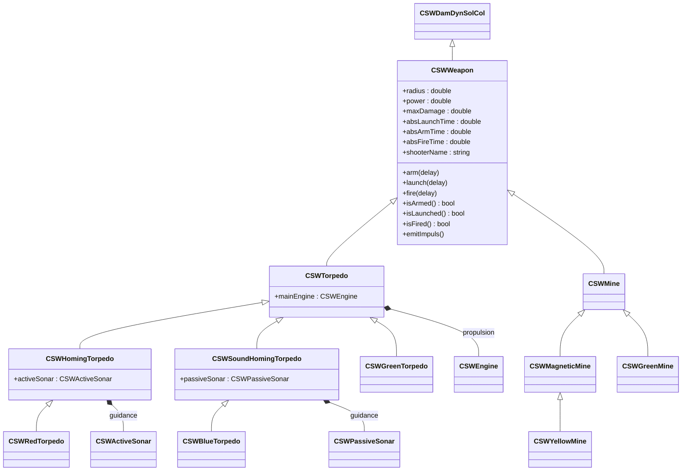
```mermaid
classDiagram
    direction TB

    class CSWWeapon {
        +radius : double
        +power : double
        +maxDamage : double
        +absLaunchTime : double
        +absArmTime : double
        +absFireTime : double
        +shooterName : string
        +arm(delay)
        +launch(delay)
        +fire(delay)
        +isArmed() bool
        +isLaunched() bool
        +isFired() bool
        +emitImpuls()
    }
    class CSWTorpedo {
        +mainEngine : CSWEngine
    }
    class CSWHomingTorpedo {
        +activeSonar : CSWActiveSonar
    }
    class CSWSoundHomingTorpedo {
        +passiveSonar : CSWPassiveSonar
    }
    class CSWMine
    class CSWMagneticMine

    class CSWGreenTorpedo
    class CSWRedTorpedo
    class CSWBlueTorpedo
    class CSWGreenMine
    class CSWYellowMine

    CSWDamDynSolCol <|-- CSWWeapon
    CSWWeapon <|-- CSWTorpedo
    CSWWeapon <|-- CSWMine
    CSWTorpedo <|-- CSWHomingTorpedo
    CSWTorpedo <|-- CSWSoundHomingTorpedo
    CSWMine <|-- CSWMagneticMine
    CSWTorpedo <|-- CSWGreenTorpedo
    CSWHomingTorpedo <|-- CSWRedTorpedo
    CSWSoundHomingTorpedo <|-- CSWBlueTorpedo
    CSWMine <|-- CSWGreenMine
    CSWMagneticMine <|-- CSWYellowMine
    CSWTorpedo *-- CSWEngine : propulsion
    CSWHomingTorpedo *-- CSWActiveSonar : guidance
    CSWSoundHomingTorpedo *-- CSWPassiveSonar : guidance
```

#### Weapon Lifecycle State Diagram

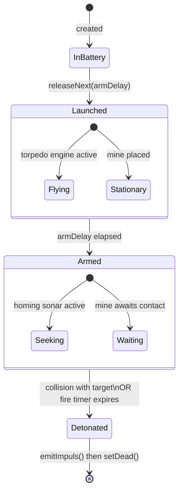
```mermaid
stateDiagram-v2
    [*] --> InBattery : created
    InBattery --> Launched : releaseNext(armDelay)
    Launched --> Armed : armDelay elapsed
    Armed --> Detonated : collision with target\nOR fire timer expires
    Detonated --> [*] : emitImpuls() then setDead()

    state Launched {
        [*] --> Flying : torpedo engine active
        [*] --> Stationary : mine placed
    }

    state Armed {
        [*] --> Seeking : homing sonar active
        [*] --> Waiting : mine awaits contact
    }
```

---

### 3.6 Sensor System

Sensors provide situational awareness to submarines. All sensors inherit from `CSWSensor`, itself a child of `CSWEquipment`. The control center aggregates all sensors for convenient access.

**Sonar scanning modes:**

| Parameter | Options |
|-----------|---------|
| Direction | `FULL` (360), `FRONT`, `BACK`, `LOCAL_DIRECTION`, `GLOBAL_POSITION` |
| Velocity | `FAST` (90 deg/s), `SLOW` (20 deg/s) |
| Range | `NEAR_RANGE`, `FAR_RANGE` |

**Active Sonar** emits a pulse and measures echo return time to calculate distance. It detects object position and identity. Results are delivered as `CSWActiveSonarPingMessage` events.

**Passive Sonar** listens for sound emissions from engines and weapons. It determines bearing and signal level but not range. It implements `CSWISoundReceiver`.

**GPS** returns the submarine's own world position.
**Gyro Compass** returns the submarine's orientation matrix.
**Moving Properties Sensor** returns velocity and angular velocity vectors.

---

### 3.7 Physics & Collision

The physics system combines custom rigid body dynamics (`CSWDynamic`) with SOLID 3.5.4 for collision detection.

**CSWDynamic** integrates forces and impulses each frame:

1. Accumulate forces (engines, gravity, magnetism) and impulses (explosions, collisions)
2. Integrate: `velocity += (totalForce / mass) * dt`
3. Update position: `position += velocity * dt`
4. Update angular momentum and orientation from torques

**CSWSolid** holds the visual mesh for OpenGL rendering.

**CSWCollideable** holds the collision mesh registered with SOLID via `DT_ShapeHandle` and `DT_ObjectHandle`. Collision pairs are detected by `DT_Test()` which fires callbacks.

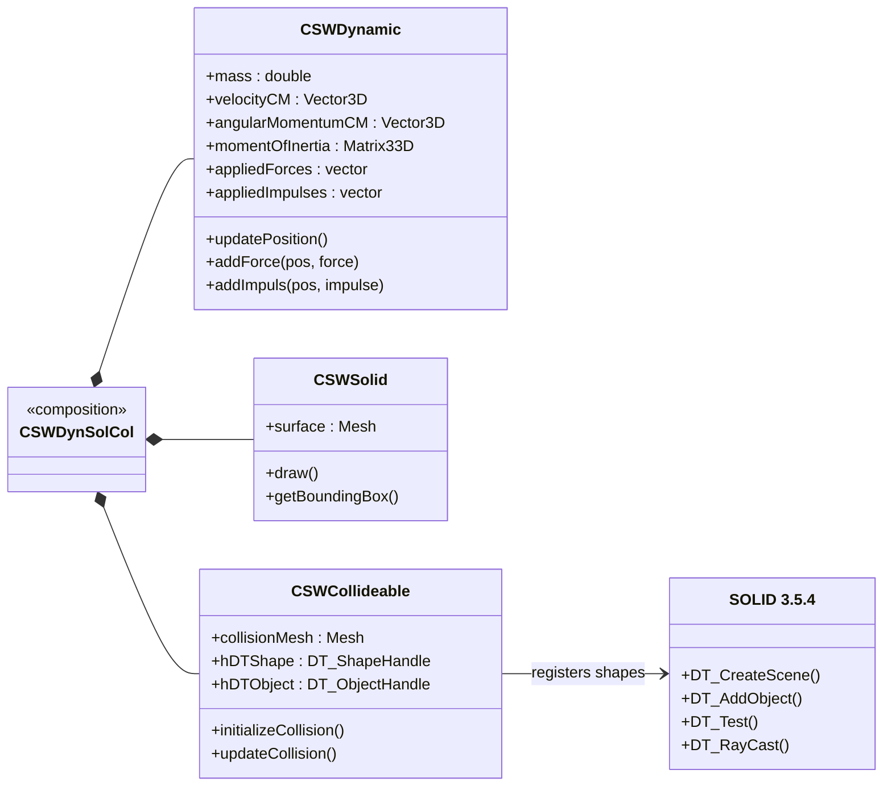
```mermaid
classDiagram
    direction LR

    class CSWDynamic {
        +mass : double
        +velocityCM : Vector3D
        +angularMomentumCM : Vector3D
        +momentOfInertia : Matrix33D
        +appliedForces : vector
        +appliedImpulses : vector
        +updatePosition()
        +addForce(pos, force)
        +addImpuls(pos, impulse)
    }
    class CSWSolid {
        +surface : Mesh
        +draw()
        +getBoundingBox()
    }
    class CSWCollideable {
        +collisionMesh : Mesh
        +hDTShape : DT_ShapeHandle
        +hDTObject : DT_ObjectHandle
        +initializeCollision()
        +updateCollision()
    }
    class CSWDynSolCol {
        <<composition>>
    }
    class SOLID["SOLID 3.5.4"] {
        +DT_CreateScene()
        +DT_AddObject()
        +DT_Test()
        +DT_RayCast()
    }

    CSWDynSolCol *-- CSWDynamic
    CSWDynSolCol *-- CSWSolid
    CSWDynSolCol *-- CSWCollideable
    CSWCollideable --> SOLID : registers shapes
```

---

### 3.8 Event & Message System

The event system provides asynchronous, decoupled communication between world objects. Events carry typed messages and have a time-to-live (max 20 seconds).

**Event creation modes:**

| Factory Method | Description |
|----------------|-------------|
| `CSWEvent::create(sender, receiver, msg, ttl)` | Point-to-point |
| `CSWEvent::createBroadcast(sender, msg, ttl)` | Sender broadcasts to all |
| `CSWEvent::createAnonymous(receiver, msg, ttl)` | Anonymous sender |

**Message types:**

| Message Class | Trigger |
|---------------|---------|
| `CSWCollisionDetectedMessage` | Two objects physically collide |
| `CSWExplosionDetectedMessage` | Weapon detonates near an object |
| `CSWActiveSonarPingMessage` | Active sonar detects a target |
| `CSWSoundEmittedMessage` | Sound propagated to a receiver |
| `CSWTextMessage` | Inter-submarine text communication via transceiver |

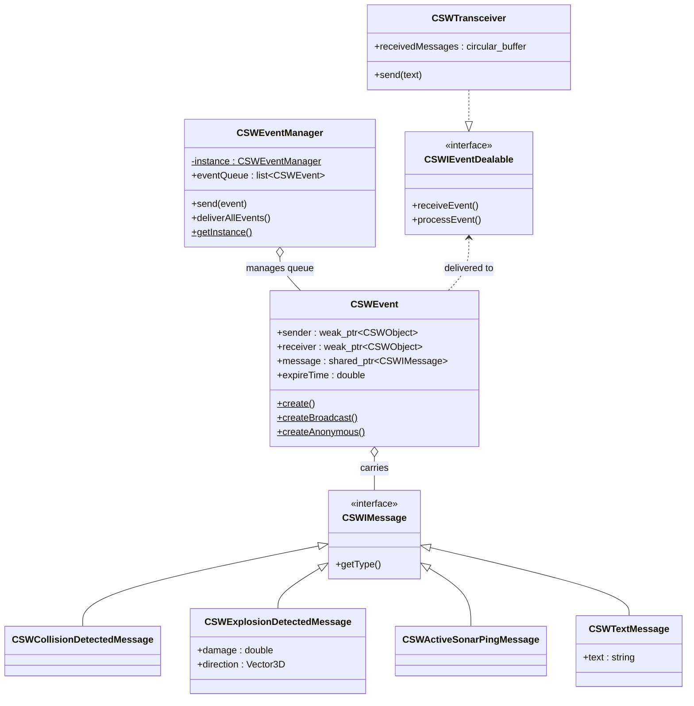
```mermaid
classDiagram
    direction TB

    class CSWEventManager {
        -instance : CSWEventManager$
        +eventQueue : list~CSWEvent~
        +send(event)
        +deliverAllEvents()
        +getInstance()$
    }
    class CSWEvent {
        +sender : weak_ptr~CSWObject~
        +receiver : weak_ptr~CSWObject~
        +message : shared_ptr~CSWIMessage~
        +expireTime : double
        +create()$
        +createBroadcast()$
        +createAnonymous()$
    }
    class CSWIMessage {
        <<interface>>
        +getType()
    }
    class CSWCollisionDetectedMessage
    class CSWExplosionDetectedMessage {
        +damage : double
        +direction : Vector3D
    }
    class CSWActiveSonarPingMessage
    class CSWTextMessage {
        +text : string
    }

    class CSWIEventDealable {
        <<interface>>
        +receiveEvent()
        +processEvent()
    }
    class CSWTransceiver {
        +receivedMessages : circular_buffer
        +send(text)
    }

    CSWEventManager o-- CSWEvent : manages queue
    CSWEvent o-- CSWIMessage : carries
    CSWIMessage <|-- CSWCollisionDetectedMessage
    CSWIMessage <|-- CSWExplosionDetectedMessage
    CSWIMessage <|-- CSWActiveSonarPingMessage
    CSWIMessage <|-- CSWTextMessage
    CSWIEventDealable <.. CSWEvent : delivered to
    CSWTransceiver ..|> CSWIEventDealable
```

---

### 3.9 Command System

Submarine behavior is driven by the Command pattern. Commands are pushed onto a `CommandProcessor` stack and executed step-by-step each frame. The `CSWCommands` class provides high-level convenience commands that compose lower-level operations.

**ARSTD Command framework:**

| Class | Role |
|-------|------|
| `ARSTD::Command` | Abstract base: `initialize()`, `step()`, `cleanup()`, `finished()`, progress [0,1] |
| `ARSTD::CommandProcessor` | Stack-based execution: push, pop, step, supports undo |
| `ARSTD::MacroCommand` | Sequential/parallel command composition |

**CSW-specific commands (`CSWVariousCommands.h`):**

| Command | Action |
|---------|--------|
| `CSWSetEngineIntensityCommand` | Set engine throttle |
| `CSWSetEngineDirectionCommand` | Set engine direction vector |
| `CSWSendEventCommand` | Send an event to another object |
| `CSWFireCommand` | Release a weapon from a battery |
| `CSWRechargeWeaponBatteryCommand` | Recharge weapons at a supply point |

**CSWCommands** provides high-level factory methods: `moveForward()`, `moveUpward()`, `setOrientationAbsoluteTowardPosition()`, `stopRotation()`, `stopMoving()`, `stopAll()`, `fireSalvo()`.

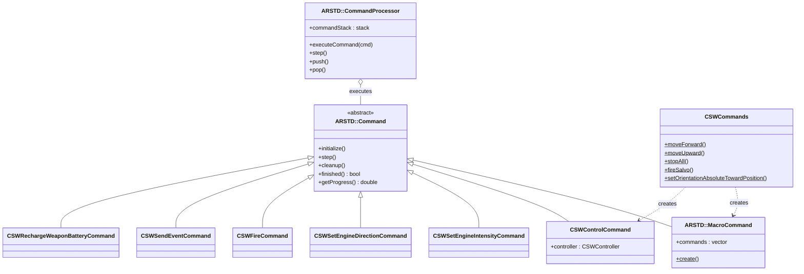
```mermaid
classDiagram
    direction TB

    class `ARSTD::Command` {
        <<abstract>>
        +initialize()
        +step()
        +cleanup()
        +finished() bool
        +getProgress() double
    }
    class `ARSTD::CommandProcessor` {
        +commandStack : stack
        +executeCommand(cmd)
        +step()
        +push()
        +pop()
    }
    class `ARSTD::MacroCommand` {
        +commands : vector
        +create()$
    }
    class CSWControlCommand {
        +controller : CSWController
    }
    class CSWSetEngineIntensityCommand
    class CSWSetEngineDirectionCommand
    class CSWFireCommand
    class CSWSendEventCommand
    class CSWRechargeWeaponBatteryCommand
    class CSWCommands {
        +moveForward()$
        +moveUpward()$
        +stopAll()$
        +fireSalvo()$
        +setOrientationAbsoluteTowardPosition()$
    }

    `ARSTD::Command` <|-- `ARSTD::MacroCommand`
    `ARSTD::Command` <|-- CSWControlCommand
    `ARSTD::Command` <|-- CSWSetEngineIntensityCommand
    `ARSTD::Command` <|-- CSWSetEngineDirectionCommand
    `ARSTD::Command` <|-- CSWFireCommand
    `ARSTD::Command` <|-- CSWSendEventCommand
    `ARSTD::Command` <|-- CSWRechargeWeaponBatteryCommand
    `ARSTD::CommandProcessor` o-- `ARSTD::Command` : executes
    CSWCommands ..> `ARSTD::MacroCommand` : creates
    CSWCommands ..> CSWControlCommand : creates
```

---

### 3.10 Damage & Resource System

**CSWDamageable** tracks object health as a value in [0, 1]. Health states:

| State | Condition |
|-------|-----------|
| Alive | health > 0.1 |
| Disabled | 0 < health <= 0.1 (equipment malfunction) |
| Zombie | health <= 0, not yet flagged dead |
| Dead | explicitly set dead, will be removed |

**CSWRechargeable** allows weapon batteries to be restocked at `CSWResourceProvider` supply points. Resource IDs identify compatible weapon types.

**CSWResourceProvider** is a static world object that provides resources (ammunition) to submarines within a maximum distance.

---

### 3.11 Python Integration

Submarine AI is written in Python and integrated via Boost.Python. Nine C++ modules are registered at application startup:

| Module | Exposed Content |
|--------|----------------|
| `CodeSubWars_Submarine` | `CSWPySubmarine` base class, method overrides |
| `CodeSubWars_Commands` | `CSWCommands`, `MacroCommand`, command factories |
| `CodeSubWars_Equipment` | Engines, weapon batteries, control center |
| `CodeSubWars_Sensors` | Sonar, GPS, compass, movement sensor |
| `CodeSubWars_Weapons` | Weapon classes, battery operations |
| `CodeSubWars_Events` | Event, EventManager, message types |
| `CodeSubWars_Math` | Vector3D, Matrix44D, Quaternion |
| `CodeSubWars_Actuators` | Engine control |
| `CodeSubWars_Common` | Settings, utilities |
| `CodeSubWars_Utilities` | Helper functions |

**GIL management:**

Each submarine runs in a per-thread `PythonContext`. Before any Python callback, the C++ wrapper acquires the GIL via `PythonContext::makeCurrent()` (RAII lock). The GIL is released when the lock goes out of scope. If a Python callback exceeds 6ms average execution time, `CSWWorldGuard` flags the submarine as erroneous and removes it.

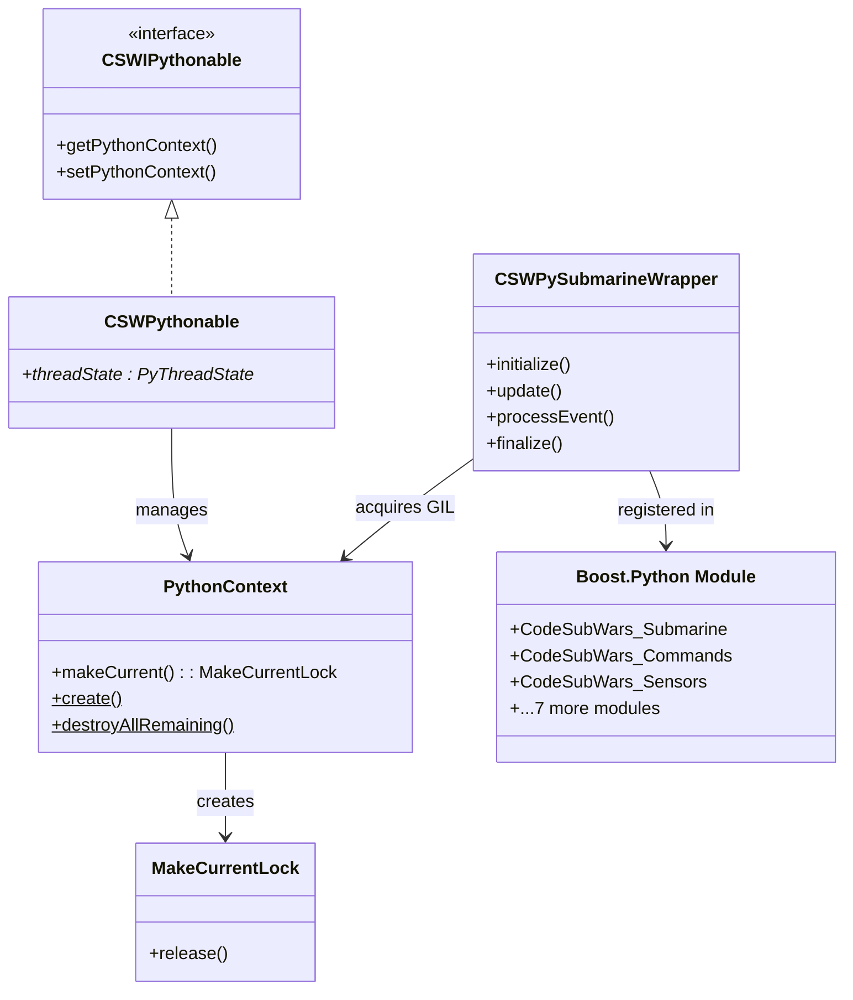
```mermaid
classDiagram
    direction TB

    class CSWIPythonable {
        <<interface>>
        +getPythonContext()
        +setPythonContext()
    }
    class CSWPythonable {
        +threadState : PyThreadState*
    }
    class PythonContext {
        +makeCurrent() : MakeCurrentLock
        +create()$
        +destroyAllRemaining()$
    }
    class MakeCurrentLock {
        +release()
    }
    class CSWPySubmarineWrapper {
        +initialize()
        +update()
        +processEvent()
        +finalize()
    }
    class `Boost.Python Module` {
        +CodeSubWars_Submarine
        +CodeSubWars_Commands
        +CodeSubWars_Sensors
        +...7 more modules
    }

    CSWIPythonable <|.. CSWPythonable
    CSWPythonable --> PythonContext : manages
    PythonContext --> MakeCurrentLock : creates
    CSWPySubmarineWrapper --> PythonContext : acquires GIL
    CSWPySubmarineWrapper --> `Boost.Python Module` : registered in
```

---

### 3.12 GUI & Visualization

The GUI is built with Qt. The main window contains multiple OpenGL viewports and information panels.

**Key classes:**

| Class | Base | Role |
|-------|------|------|
| `CodeSubwarsMainWindow` | `QMainWindow` | Main application window with menus, toolbars, timers |
| `OpenGLView` | `QGLWidget` | Base OpenGL viewport with camera, mouse, FPS |
| `SceneView` | `OpenGLView` | 3D scene rendering, object selection, camera switching |
| `InformationView` | `QWidget` | Text/data panel for selected object |
| `SystemView` | `QWidget` | System-level visualization |

**Visualizers** (each is a `QWidget` with embedded OpenGL):

| Visualizer | Shows |
|------------|-------|
| `CSWActiveSonarVisualizer` | Sonar beam direction and detection results |
| `CSWPassiveSonarVisualizer` | Bearing/level display for passive sonar |
| `CSWEngineVisualizer` | Engine power and direction indicator |
| `CSWWeaponBatteryVisualizer` | Ammunition status |
| `CSWExplosionVisualizer` | Explosion effects in 3D scene |
| `CSWSoundVisualizer` | Sound propagation field |
| `CSWMapVisualizer` | Tactical map overlay |

**Timer-driven updates:**

- `m_RecalcWorldTimer` --> `CSWWorld::recalculate()` (physics tick)
- `m_UpdateTimer` --> `redraw()` signal --> viewports repaint

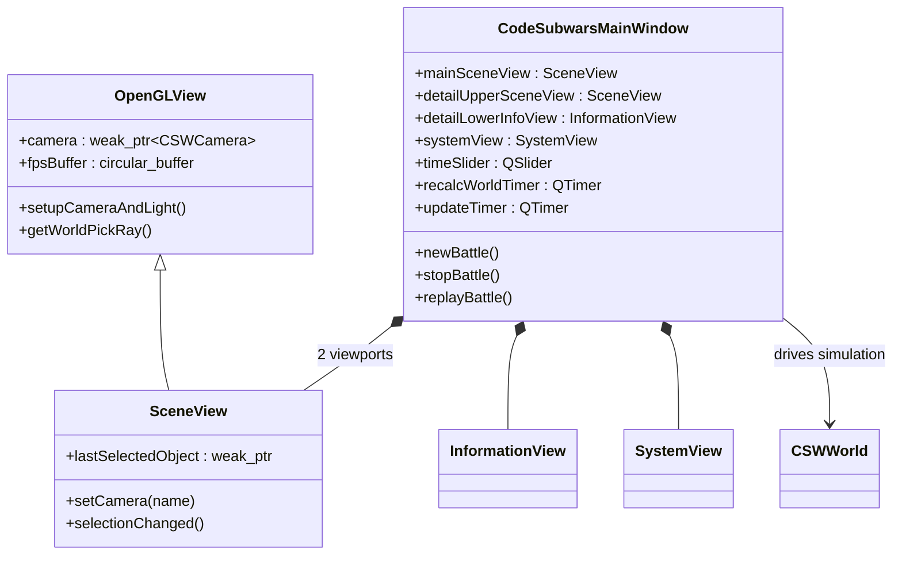
```mermaid
classDiagram
    direction TB

    class CodeSubwarsMainWindow {
        +mainSceneView : SceneView
        +detailUpperSceneView : SceneView
        +detailLowerInfoView : InformationView
        +systemView : SystemView
        +timeSlider : QSlider
        +recalcWorldTimer : QTimer
        +updateTimer : QTimer
        +newBattle()
        +stopBattle()
        +replayBattle()
    }
    class OpenGLView {
        +camera : weak_ptr~CSWCamera~
        +fpsBuffer : circular_buffer
        +setupCameraAndLight()
        +getWorldPickRay()
    }
    class SceneView {
        +lastSelectedObject : weak_ptr
        +setCamera(name)
        +selectionChanged()
    }
    class InformationView
    class SystemView

    CodeSubwarsMainWindow *-- SceneView : 2 viewports
    CodeSubwarsMainWindow *-- InformationView
    CodeSubwarsMainWindow *-- SystemView
    OpenGLView <|-- SceneView
    CodeSubwarsMainWindow --> CSWWorld : drives simulation
```

---

### 3.13 ARSTD Library

ARSTD (Andreas Rose Standard Template) is a reusable C++ utility library providing foundational services.

| Submodule | Key Classes | Purpose |
|-----------|-------------|---------|
| **Command** | `Command`, `CommandProcessor`, `MacroCommand` | Command pattern framework with stack-based execution |
| **Common** | `Types` | Cross-platform integer type definitions |
| **Math** | `Vector3<T>`, `Vector4<T>`, `Matrix44<T>`, `Matrix33<T>`, `Quaternion<T>` | Template math library for 3D graphics and physics |
| **Geometry** | `Ray3<T>`, `Plane<T>`, `Mesh`, `AxisAlignedBoundingBox<T>` | Geometric primitives, STL mesh loading, AABB |
| **Message** | `Message<ObjectType>` | Tree-based message broadcasting |
| **Misc** | `Time`, `PIDController` | Simulation clock (wall/auto), PID control loop |
| **OpenGL** | `OpenGLTools` | Tripod, bounding box, highlight rendering helpers |
| **Structures** | `Element`, `Node` | Tree node primitives (name, parent, children) |

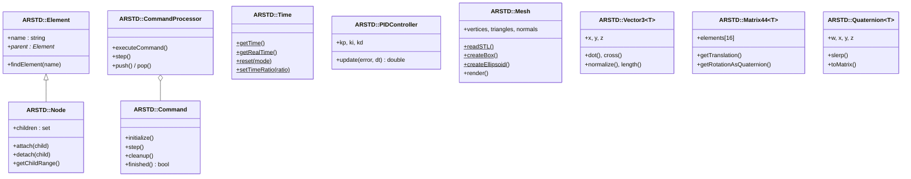
```mermaid
classDiagram
    direction TB

    class `ARSTD::Element` {
        +name : string
        +parent : Element*
        +findElement(name)
    }
    class `ARSTD::Node` {
        +children : set
        +attach(child)
        +detach(child)
        +getChildRange()
    }
    class `ARSTD::Command` {
        +initialize()
        +step()
        +cleanup()
        +finished() bool
    }
    class `ARSTD::CommandProcessor` {
        +executeCommand()
        +step()
        +push() / pop()
    }
    class `ARSTD::Time` {
        +getTime()$
        +getRealTime()$
        +reset(mode)$
        +setTimeRatio(ratio)$
    }
    class `ARSTD::PIDController` {
        +kp, ki, kd
        +update(error, dt) double
    }
    class `ARSTD::Mesh` {
        +vertices, triangles, normals
        +readSTL()$
        +createBox()$
        +createEllipsoid()$
        +render()
    }
    class `ARSTD::Vector3~T~` {
        +x, y, z
        +dot(), cross()
        +normalize(), length()
    }
    class `ARSTD::Matrix44~T~` {
        +elements[16]
        +getTranslation()
        +getRotationAsQuaternion()
    }
    class `ARSTD::Quaternion~T~` {
        +w, x, y, z
        +slerp()
        +toMatrix()
    }

    `ARSTD::Element` <|-- `ARSTD::Node`
    `ARSTD::CommandProcessor` o-- `ARSTD::Command`
```

---

## 4. Sequence Diagrams

### 4.1 Application Startup

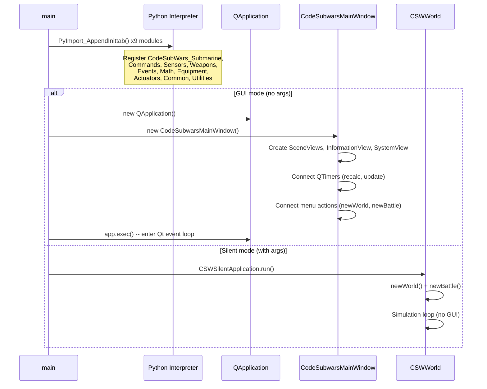
```mermaid
sequenceDiagram
    participant main
    participant PyInit as Python Interpreter
    participant QApp as QApplication
    participant MW as CodeSubwarsMainWindow
    participant World as CSWWorld

    main->>PyInit: PyImport_AppendInittab() x9 modules
    Note over PyInit: Register CodeSubWars_Submarine,<br/>Commands, Sensors, Weapons,<br/>Events, Math, Equipment,<br/>Actuators, Common, Utilities

    alt GUI mode (no args)
        main->>QApp: new QApplication()
        main->>MW: new CodeSubwarsMainWindow()
        MW->>MW: Create SceneViews, InformationView, SystemView
        MW->>MW: Connect QTimers (recalc, update)
        MW->>MW: Connect menu actions (newWorld, newBattle)
        main->>QApp: app.exec() -- enter Qt event loop
    else Silent mode (with args)
        main->>World: CSWSilentApplication.run()
        World->>World: newWorld() + newBattle()
        World->>World: Simulation loop (no GUI)
    end
```

### 4.2 Battle Setup

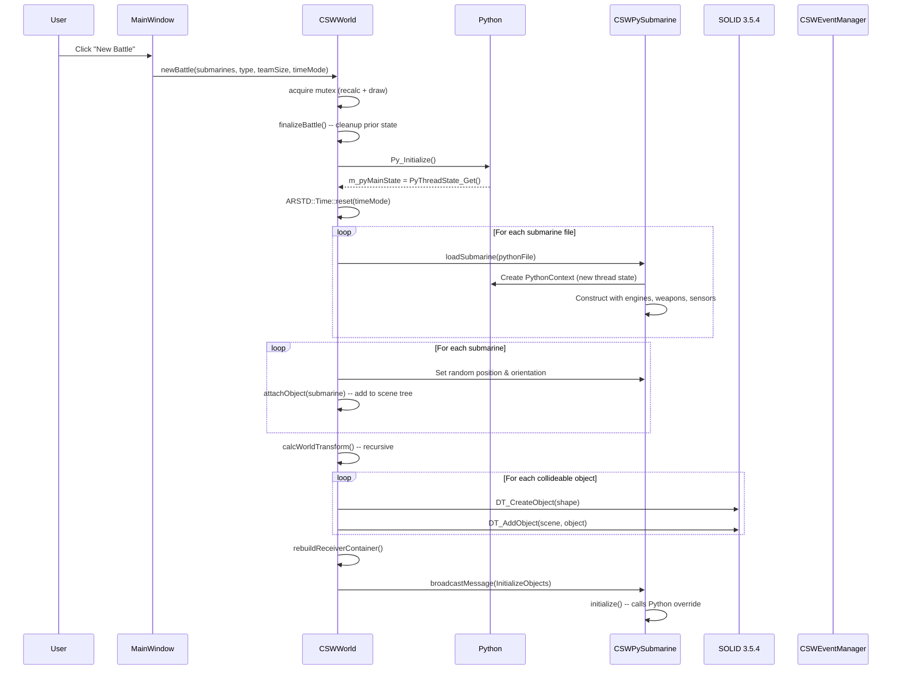
```mermaid
sequenceDiagram
    participant User
    participant MW as MainWindow
    participant World as CSWWorld
    participant PyInit as Python
    participant Sub as CSWPySubmarine
    participant SOLID as SOLID 3.5.4
    participant EvtMgr as CSWEventManager

    User->>MW: Click "New Battle"
    MW->>World: newBattle(submarines, type, teamSize, timeMode)
    World->>World: acquire mutex (recalc + draw)
    World->>World: finalizeBattle() -- cleanup prior state

    World->>PyInit: Py_Initialize()
    PyInit-->>World: m_pyMainState = PyThreadState_Get()

    World->>World: ARSTD::Time::reset(timeMode)

    loop For each submarine file
        World->>Sub: loadSubmarine(pythonFile)
        Sub->>PyInit: Create PythonContext (new thread state)
        Sub->>Sub: Construct with engines, weapons, sensors
    end

    loop For each submarine
        World->>Sub: Set random position & orientation
        World->>World: attachObject(submarine) -- add to scene tree
    end

    World->>World: calcWorldTransform() -- recursive

    loop For each collideable object
        World->>SOLID: DT_CreateObject(shape)
        World->>SOLID: DT_AddObject(scene, object)
    end

    World->>World: rebuildReceiverContainer()
    World->>Sub: broadcastMessage(InitializeObjects)
    Sub->>Sub: initialize() -- calls Python override
```

### 4.3 Simulation Loop (Single Frame)

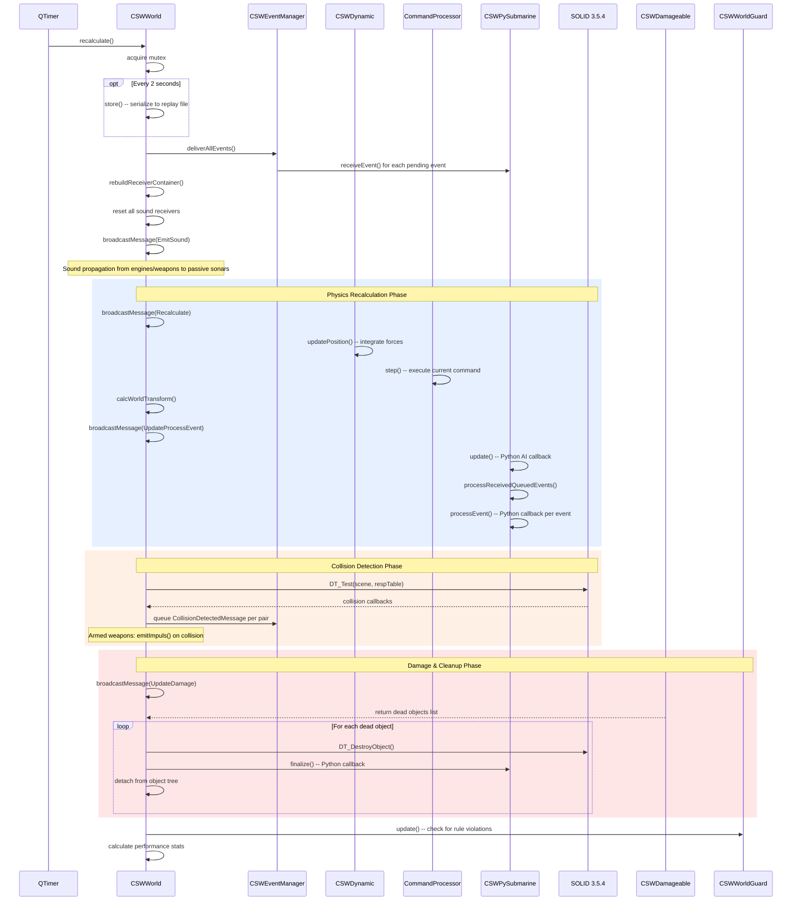
```mermaid
sequenceDiagram
    participant Timer as QTimer
    participant World as CSWWorld
    participant EvtMgr as CSWEventManager
    participant Dyn as CSWDynamic
    participant Cmd as CommandProcessor
    participant Sub as CSWPySubmarine
    participant SOLID as SOLID 3.5.4
    participant Dmg as CSWDamageable
    participant Guard as CSWWorldGuard

    Timer->>World: recalculate()
    World->>World: acquire mutex

    opt Every 2 seconds
        World->>World: store() -- serialize to replay file
    end

    World->>EvtMgr: deliverAllEvents()
    EvtMgr->>Sub: receiveEvent() for each pending event

    World->>World: rebuildReceiverContainer()
    World->>World: reset all sound receivers

    World->>World: broadcastMessage(EmitSound)
    Note over World: Sound propagation from engines/weapons to passive sonars

    rect rgb(230, 240, 255)
        Note over World,SOLID: Physics Recalculation Phase

        World->>World: broadcastMessage(Recalculate)
        Dyn->>Dyn: updatePosition() -- integrate forces
        Cmd->>Cmd: step() -- execute current command

        World->>World: calcWorldTransform()

        World->>World: broadcastMessage(UpdateProcessEvent)
        Sub->>Sub: update() -- Python AI callback
        Sub->>Sub: processReceivedQueuedEvents()
        Sub->>Sub: processEvent() -- Python callback per event
    end

    rect rgb(255, 240, 230)
        Note over World,SOLID: Collision Detection Phase

        World->>SOLID: DT_Test(scene, respTable)
        SOLID-->>World: collision callbacks
        World->>EvtMgr: queue CollisionDetectedMessage per pair

        Note over World: Armed weapons: emitImpuls() on collision
    end

    rect rgb(255, 230, 230)
        Note over World,Guard: Damage & Cleanup Phase

        World->>World: broadcastMessage(UpdateDamage)
        Dmg-->>World: return dead objects list

        loop For each dead object
            World->>SOLID: DT_DestroyObject()
            World->>Sub: finalize() -- Python callback
            World->>World: detach from object tree
        end
    end

    World->>Guard: update() -- check for rule violations
    World->>World: calculate performance stats
```

### 4.4 Weapon Firing and Detonation

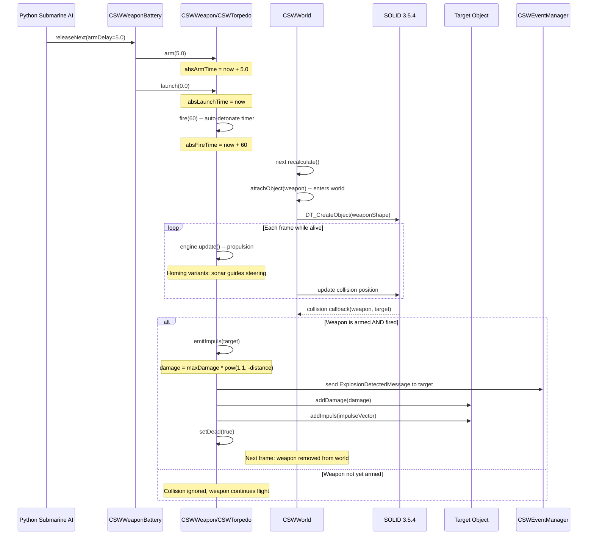
```mermaid
sequenceDiagram
    participant PySub as Python Submarine AI
    participant Battery as CSWWeaponBattery
    participant Weapon as CSWWeapon/CSWTorpedo
    participant World as CSWWorld
    participant SOLID as SOLID 3.5.4
    participant Target as Target Object
    participant EvtMgr as CSWEventManager

    PySub->>Battery: releaseNext(armDelay=5.0)
    Battery->>Weapon: arm(5.0)
    Note over Weapon: absArmTime = now + 5.0
    Battery->>Weapon: launch(0.0)
    Note over Weapon: absLaunchTime = now
    Weapon->>Weapon: fire(60) -- auto-detonate timer
    Note over Weapon: absFireTime = now + 60

    World->>World: next recalculate()
    World->>World: attachObject(weapon) -- enters world
    World->>SOLID: DT_CreateObject(weaponShape)

    loop Each frame while alive
        Weapon->>Weapon: engine.update() -- propulsion
        Note over Weapon: Homing variants: sonar guides steering
        World->>SOLID: update collision position
    end

    SOLID-->>World: collision callback(weapon, target)

    alt Weapon is armed AND fired
        Weapon->>Weapon: emitImpuls(target)
        Note over Weapon: damage = maxDamage * pow(1.1, -distance)
        Weapon->>EvtMgr: send ExplosionDetectedMessage to target
        Weapon->>Target: addDamage(damage)
        Weapon->>Target: addImpuls(impulseVector)
        Weapon->>Weapon: setDead(true)

        Note over World: Next frame: weapon removed from world
    else Weapon not yet armed
        Note over Weapon: Collision ignored, weapon continues flight
    end
```

### 4.5 Python Callback Flow

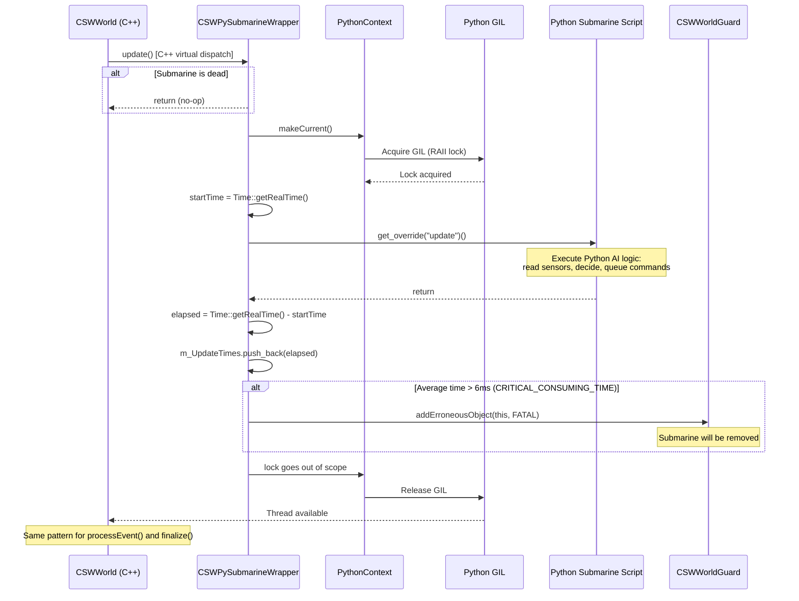
```mermaid
sequenceDiagram
    participant World as CSWWorld (C++)
    participant Wrapper as CSWPySubmarineWrapper
    participant Ctx as PythonContext
    participant GIL as Python GIL
    participant PySub as Python Submarine Script
    participant Guard as CSWWorldGuard

    World->>Wrapper: update() [C++ virtual dispatch]

    alt Submarine is dead
        Wrapper-->>World: return (no-op)
    end

    Wrapper->>Ctx: makeCurrent()
    Ctx->>GIL: Acquire GIL (RAII lock)
    GIL-->>Ctx: Lock acquired

    Wrapper->>Wrapper: startTime = Time::getRealTime()

    Wrapper->>PySub: get_override("update")()
    Note over PySub: Execute Python AI logic:<br/>read sensors, decide, queue commands

    PySub-->>Wrapper: return

    Wrapper->>Wrapper: elapsed = Time::getRealTime() - startTime
    Wrapper->>Wrapper: m_UpdateTimes.push_back(elapsed)

    alt Average time > 6ms (CRITICAL_CONSUMING_TIME)
        Wrapper->>Guard: addErroneousObject(this, FATAL)
        Note over Guard: Submarine will be removed
    end

    Wrapper->>Ctx: lock goes out of scope
    Ctx->>GIL: Release GIL
    GIL-->>World: Thread available

    Note over World: Same pattern for processEvent() and finalize()
```

### 4.6 Event Delivery

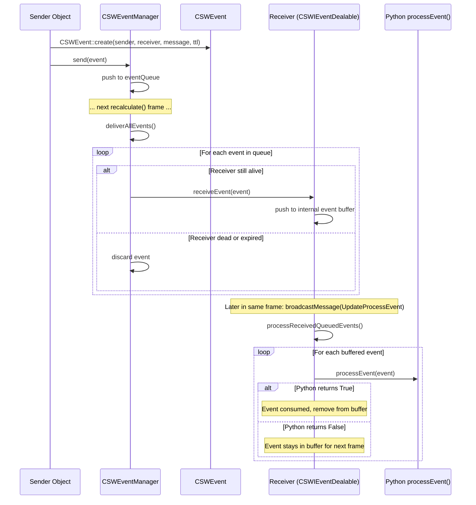
```mermaid
sequenceDiagram
    participant Sender as Sender Object
    participant EvtMgr as CSWEventManager
    participant Event as CSWEvent
    participant Receiver as Receiver (CSWIEventDealable)
    participant PySub as Python processEvent()

    Sender->>Event: CSWEvent::create(sender, receiver, message, ttl)
    Sender->>EvtMgr: send(event)
    EvtMgr->>EvtMgr: push to eventQueue

    Note over EvtMgr: ... next recalculate() frame ...

    EvtMgr->>EvtMgr: deliverAllEvents()

    loop For each event in queue
        alt Receiver still alive
            EvtMgr->>Receiver: receiveEvent(event)
            Receiver->>Receiver: push to internal event buffer
        else Receiver dead or expired
            EvtMgr->>EvtMgr: discard event
        end
    end

    Note over Receiver: Later in same frame: broadcastMessage(UpdateProcessEvent)

    Receiver->>Receiver: processReceivedQueuedEvents()

    loop For each buffered event
        Receiver->>PySub: processEvent(event)
        alt Python returns True
            Note over Receiver: Event consumed, remove from buffer
        else Python returns False
            Note over Receiver: Event stays in buffer for next frame
        end
    end
```

---

## 5. Interface Summary

The system uses interfaces extensively to tag object capabilities. The simulation loop queries these interfaces to determine which objects participate in each phase.

| Interface | Methods | Implemented By |
|-----------|---------|----------------|
| `CSWIUpdateable` | `update()` | Submarines, active rocks, equipment, black holes |
| `CSWICommandable` | `step()`, `getCommandProcessor()` | Submarines |
| `CSWIEventDealable` | `receiveEvent()`, `processEvent()` | Submarines, transceivers |
| `CSWIDynamic` | `updatePosition()`, `addForce()` | All physics bodies |
| `CSWISolid` | `draw()` | All visible objects |
| `CSWICollideable` | `initializeCollision()` | All collideable objects |
| `CSWIDamageable` | `addDamage()`, `isAlive()` | Submarines, weapons, rocks |
| `CSWISoundEmitter` | `emitSound()` | Engines, weapons |
| `CSWISoundReceiver` | `addSound()`, `getLevel()` | Passive sonar |
| `CSWIImpulsEmitter` | `emitImpuls()` | Weapons, submarines |
| `CSWIForceEmitter` | `emitForce()` | Black holes, magnets, magnetic mines |
| `CSWIPythonable` | `getPythonContext()` | Python submarines, weapons |
| `CSWIRechargeable` | `recharge()` | Weapon batteries |
