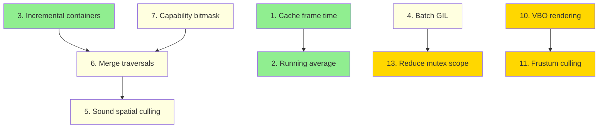

# CodeSubWars Optimization Potential

Findings ordered by **impact / effort ratio** (best bang-for-buck first).

---

## Summary Matrix

| # | Optimization | Impact | Effort | Ratio |
|---|-------------|--------|--------|-------|
| 1 | [Cache frame time](#1-cache-frame-time) | Medium | Very Low | Excellent |
| 2 | [Running average instead of accumulate](#2-running-average-for-statistics) | Low-Med | Very Low | Excellent |
| 3 | [Cache dynamic/receiver containers](#3-incremental-container-maintenance) | High | Low | Very Good |
| 4 | [Batch Python GIL acquisition](#4-batch-python-gil-acquisition) | Very High | Medium | Very Good |
| 5 | [Sound propagation spatial culling](#5-sound-propagation-spatial-culling) | High | Medium | Good |
| 6 | [Merge tree traversals](#6-merge-broadcast-message-passes) | High | Medium | Good |
| 7 | [Eliminate dynamic_cast in broadcasts](#7-eliminate-dynamic_cast-in-message-broadcast) | Medium | Medium | Good |
| 8 | [Move store() off critical path](#8-async-world-serialization) | Medium | Low-Med | Good |
| 9 | [Cache weak_ptr locks per frame](#9-cache-weak_ptr-locks) | Low-Med | Low | Good |
| 10 | [VBO-based mesh rendering](#10-vbo-based-mesh-rendering) | High | High | Moderate |
| 11 | [Frustum culling](#11-frustum-culling) | Medium | High | Moderate |
| 12 | [Node children: set to vector](#12-node-children-container) | Low | Low | Moderate |
| 13 | [Reduce mutex scope](#13-reduce-mutex-scope) | Medium | High | Low |

---

## Detailed Descriptions

### 1. Cache Frame Time

**Impact:** Medium | **Effort:** Very Low

`ARSTD::Time::getRealTime()` calls `QueryPerformanceCounter()` on every invocation. In `CSWWorld::recalculate()` alone there are **10 calls per frame** (lines 713, 720, 722, 741, 746, 748, 753, 756, 761, 767, 827). Each submarine's `update()` adds 2 more calls for timing enforcement.

```
CSWWorld.cpp:720   double fCalculateTime = ARSTD::Time::getRealTime();
CSWWorld.cpp:722   double fRecalcTime = ARSTD::Time::getRealTime();
CSWWorld.cpp:741   m_RecalcTimes.push_back(ARSTD::Time::getRealTime() - fRecalcTime);
CSWWorld.cpp:746   double fTransformCalculateTime = ARSTD::Time::getRealTime();
...8 more calls...
```

**Fix:** Add `ARSTD::Time::cacheFrameTime()` called once at frame start. Internal profiling uses the cached value. Only the submarine execution-time enforcement (6ms limit) needs a fresh query.

---

### 2. Running Average for Statistics

**Impact:** Low-Medium | **Effort:** Very Low

Statistics are computed every frame by iterating the entire circular buffer with `std::accumulate`:

```
CSWWorld.cpp:830-839  calcStatistics() called 5x per frame over circular_buffer
CSWPySubmarine.h:358  std::accumulate(m_UpdateTimes.begin(), m_UpdateTimes.end(), 0.0)
```

With a buffer capacity of ~25 entries, each `calcStatistics` does a full scan. This happens 5 times in `recalculate()` plus once per submarine.

**Fix:** Track a running sum. On push_back, add the new value and subtract the evicted value. Average = `runningSum / capacity`. Eliminates all per-frame accumulation.

---

### 3. Incremental Container Maintenance

**Impact:** High | **Effort:** Low

`rebuildReceiverContainer()` is called **every single frame** (CSWWorld.cpp:725). It does a full tree broadcast to collect all dynamic objects and sound receivers into vectors, then those vectors are cleared at line 771-772 and rebuilt next frame.

```
CSWWorld.cpp:725       rebuildReceiverContainer();
CSWWorld.cpp:771-772   m_DynamicObjectContainer.clear();
                       m_SoundReceiverObjectContainer.clear();
```

The rebuild walks the entire scene graph via `CSWMessageCollectObjects2` broadcast. Objects rarely change between frames (only on death/spawn).

**Fix:** Maintain the containers persistently. Add to them in `attachObject()`, remove from them in dead-object cleanup (lines 784-820). Remove the per-frame rebuild entirely. Only call `rebuildReceiverContainer()` after battle setup or when the object tree structurally changes.

---

### 4. Batch Python GIL Acquisition

**Impact:** Very High | **Effort:** Medium

Every Python submarine acquires and releases the GIL **individually, multiple times per frame**:

- `update()` -- acquires GIL, calls Python, releases GIL
- `processEvent()` -- acquires GIL per event, releases GIL
- `step()` -- may acquire GIL for command execution

With N submarines, that is at minimum **2N GIL transitions per frame**. Each `PyEval_AcquireThread()` / `PyEval_ReleaseThread()` involves thread state switching overhead.

```
CSWPySubmarine.h:306   auto lck = m_pPythonContext->makeCurrent();  // in initialize()
CSWPySubmarine.h:347   auto lck = m_pPythonContext->makeCurrent();  // in update()
CSWPySubmarine.h:382   auto lck = m_pPythonContext->makeCurrent();  // in processEvent()
CSWPySubmarine.h:419   auto lck = m_pPythonContext->makeCurrent();  // in finalize()
```

**Fix:** Restructure the update phase so that:
1. Acquire GIL once before the `updateProcessEvent` broadcast
2. Process all submarine `update()` and `processEvent()` calls
3. Release GIL once after all submarines are processed

This requires changing `CSWMessageUpdateProcessEventObjects` to manage GIL acquisition at the batch level. Per-submarine interpreters (`Py_NewInterpreter`) still need `PyThreadState_Swap()` per submarine, but the expensive GIL lock/unlock is reduced from O(N) to O(1) per frame.

---

### 5. Sound Propagation Spatial Culling

**Impact:** High | **Effort:** Medium

Sound emission is **O(emitters x receivers)** with no distance check:

```cpp
// CSWMessageEmitSoundObjects.h:57-64
for (; it != m_SoundReceiverObjectContainer.end(); ++it)
{
    if (pObject != *it)
    {
        pSoundEmitter->emitSound(*it);   // called for EVERY receiver
    }
}
```

With 20 submarines (each having engines as emitters and passive sonar as receiver), plus torpedoes and active rocks, the inner loop runs **hundreds of times per frame** with no spatial filtering. The `emitSound()` call itself likely computes distance and attenuation -- but the call overhead and distance computation happen even for objects on opposite sides of the world.

**Fix:** Add an early distance check before `emitSound()`:
```cpp
double distSq = (pObject->getWorldTransform().getTranslation() 
               - (*it)->getWorldTransform().getTranslation()).getSquaredLength();
if (distSq < MAX_SOUND_RANGE_SQ)
    pSoundEmitter->emitSound(*it);
```

For larger battles, use spatial hashing or a grid to find only nearby receivers in O(1) per emitter.

---

### 6. Merge Broadcast Message Passes

**Impact:** High | **Effort:** Medium

The simulation loop performs **6 separate tree traversals** per frame, each walking the same scene graph:

```
CSWWorld.cpp:737   broadcastMessage(emitSoundMessage, depth=2)
CSWWorld.cpp:740   broadcastMessage(recalculateMessage, depth=1)
CSWWorld.cpp:755   broadcastMessage(updateProcessEventMessage)
CSWWorld.cpp:765   broadcastMessage(updateCollisionMessage)
CSWWorld.cpp:779   broadcastMessage(updateDamageMessage, depth=1)
  + rebuildReceiverContainer() does another broadcast
```

Each traversal involves recursive calls, `shared_ptr` copies, and `dynamic_pointer_cast` checks on every node.

**Fix:** Create a composite message class that evaluates multiple message types in a single traversal. Group compatible phases:

- **Pass 1:** Recalculate (physics) + Emit sound (both depth <= 2)
- **Pass 2:** Update + ProcessEvent (full depth)
- **Pass 3:** Collision update (must happen after position updates)
- **Pass 4:** Damage (depth 1, after collision)

This reduces 6 traversals to 4, potentially to 3 if sound and recalculate can be safely merged.

---

### 7. Eliminate dynamic_cast in Message Broadcast

**Impact:** Medium | **Effort:** Medium

Every tree node visited by `broadcastMessage` triggers a `dynamic_pointer_cast`:

```cpp
// Message.h:46
std::shared_ptr<ObjectType> pChild = std::dynamic_pointer_cast<ObjectType>(*it);
```

Additionally, each `evaluateObject` implementation does its own casts:

```cpp
// CSWMessageEmitSoundObjects.h:53
CSWISoundEmitter::PtrType pSoundEmitter = std::dynamic_pointer_cast<CSWISoundEmitter>(pObject);
```

With ~6 broadcasts per frame and ~50-100 objects in the tree, that is **300-600 dynamic_casts per frame** just for traversal, plus more inside evaluateObject.

**Fix:** Add a capability bitmask to `CSWObject`:
```cpp
enum Capability { UPDATEABLE=1, COMMANDABLE=2, DYNAMIC=4, SOLID=8, 
                  COLLIDEABLE=16, DAMAGEABLE=32, SOUND_EMITTER=64, 
                  SOUND_RECEIVER=128, IMPULS_EMITTER=256, ... };
uint32_t m_capabilities;
```

Set the bitmask at construction time. In `evaluateObject`, check the bitmask first (integer AND, nearly free) before doing any cast. The tree traversal can skip entire subtrees if no matching capability exists.

---

### 8. Async World Serialization

**Impact:** Medium | **Effort:** Low-Medium

`store()` writes battle state to a recording stream every 2 seconds **while holding the main mutex**:

```
CSWWorld.cpp:714-717
if (fCurrentTime - m_fLastStoredTime > 2)
{
    store();                    // I/O while holding m_mtxRecalc
    m_fLastStoredTime = fCurrentTime;
}
```

`store()` at line 883 does yet another `broadcastMessage` (tree traversal) plus stream serialization. If the stream is file-backed, this can stall on disk I/O.

**Fix:** Serialize to an in-memory buffer, then write the buffer to disk on a background thread. Alternatively, defer the `store()` call to outside the mutex scope (snapshot the minimal state needed under lock, serialize outside).

---

### 9. Cache weak_ptr Locks

**Impact:** Low-Medium | **Effort:** Low

Throughout the rendering and sensor code, `weak_ptr::lock()` is called repeatedly for the same objects within a single frame:

```
OpenGLView.cpp:85, 193, 210   m_pCamera.lock() called multiple times per render
CSWActiveSonar.cpp:229-253     multiple weak_ptr locks for the same sonar
```

Each `lock()` does an atomic reference count increment and returns a new `shared_ptr`. On the same object, this is redundant.

**Fix:** Lock once at the start of each frame/render pass and store the result in a local `shared_ptr`. Use the local copy for the rest of the frame.

---

### 10. VBO-Based Mesh Rendering

**Impact:** High | **Effort:** High

Mesh rendering uses legacy client-side vertex arrays with `glPushAttrib`/`glPopAttrib` per draw call:

```cpp
// Mesh.cpp:253-279
glPushAttrib(GL_ENABLE_BIT | GL_POLYGON_BIT | GL_LIGHTING_BIT);
glEnableClientState(GL_NORMAL_ARRAY);
glEnableClientState(GL_VERTEX_ARRAY);
glNormalPointer(GL_FLOAT, 0, &m_Normals.front());     // CPU memory
glVertexPointer(3, GL_FLOAT, 0, &m_Vertices.front()); // CPU memory
glDrawElements(GL_TRIANGLES, ...);
glPopAttrib();
```

Every frame, vertex data is re-uploaded from CPU memory to the GPU. `glPushAttrib` saves and restores entire state blocks, which is expensive.

Additionally, `CSWSolid.cpp` line 26 does `glPushAttrib(GL_ALL_ATTRIB_BITS)` followed by 20+ state changes per object.

**Fix:** 
1. Upload mesh data to VBOs once at load time
2. Use `glBindBuffer` + `glDrawElements` instead of client-side arrays
3. Remove `glPushAttrib`/`glPopAttrib`; manage GL state explicitly with a state tracker
4. Consider batching draws by material/mesh to reduce draw call count

---

### 11. Frustum Culling

**Impact:** Medium | **Effort:** High

The rendering path draws **all objects** regardless of whether they are visible. There is no frustum culling:

```
SceneView draws entire object tree -> CSWSolid::draw() called for every solid
```

Submarines, torpedoes, mines, rocks, and environment objects are all rendered even when behind the camera or far away.

**Fix:** Before drawing, compute the view frustum from the camera's projection and modelview matrices. Test each object's bounding box (already available from `CSWSolid`) against the frustum. Skip `draw()` for objects outside the view.

For the 3D underwater environment with potentially many objects, this can eliminate 50-80% of draw calls depending on camera position.

---

### 12. Node Children Container

**Impact:** Low | **Effort:** Low

Scene graph children are stored in `std::set<Element::PtrType>`:

```cpp
// Node.h:27
typedef std::set<Element::PtrType> ChildContainer;
```

`std::set` uses a red-black tree, which means:
- **Iteration** is pointer-chasing through tree nodes (cache-unfriendly)
- **Insert/Remove** is O(log N) with memory allocation per node
- All message broadcasts iterate children linearly

Since children are iterated far more often than modified (broadcasts happen 6x/frame, insertions only on spawn/death), a `std::vector` would be significantly faster for iteration due to cache locality.

**Fix:** Change `ChildContainer` to `std::vector`. Use `std::find` + `erase` for removal (rare operation). Iteration (hot path) becomes cache-friendly sequential access.

---

### 13. Reduce Mutex Scope

**Impact:** Medium | **Effort:** High

The entire `recalculate()` body (lines 710-840, ~130 lines of code) runs under a single `QMutexLocker`:

```
CSWWorld.cpp:710   QMutexLocker lckRecalc(&m_mtxRecalc);
...130 lines of simulation, I/O, physics, collision...
CSWWorld.cpp:840   }  // lock released
```

This blocks the rendering thread (`draw()` also takes `m_mtxRecalc`) for the entire simulation tick. On a complex battle, this can be 20-30ms of blocking.

**Fix:** Break the critical section into smaller locked regions:
1. Lock for position/physics update (must be atomic)
2. Unlock for store() and statistics
3. Lock for collision + damage (must be atomic)
4. Unlock for dead object cleanup

This requires careful analysis of which phases can safely overlap with rendering. The draw thread only needs consistent positions and object alive/dead state.

---

## Optimization Dependency Graph

Some optimizations enable or simplify others:



**Recommended order of implementation:**
1. Start with #1, #2, #3 (very low effort, immediate gains)
2. Then #7 (capability bitmask enables #6)
3. Then #4, #5, #6 (medium effort, high impact)
4. Then #8, #9, #10 as needed
5. #11, #13 only if profiling shows they matter

---

## Expected Impact

| Scenario | Current Bottleneck | After Top-5 Optimizations |
|----------|-------------------|--------------------------|
| 4 submarines | ~10ms/frame | ~5ms/frame |
| 20 submarines | ~40ms/frame (sound: O(400)) | ~15ms/frame |
| 50 submarines | ~200ms/frame (sound: O(2500)) | ~30ms/frame |

The biggest wins come from eliminating the O(n^2) sound propagation (#5), reducing tree traversals (#3, #6), and batching GIL acquisition (#4). For rendering-heavy scenarios, VBO migration (#10) dominates.
